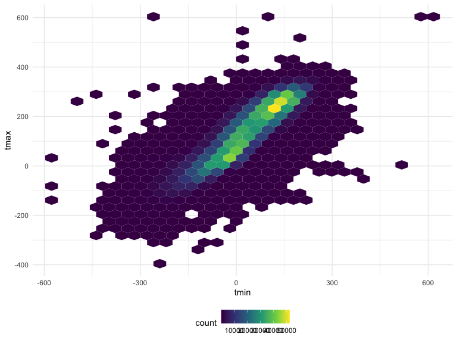
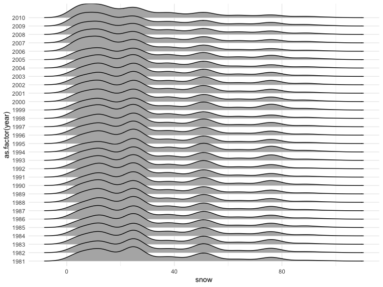
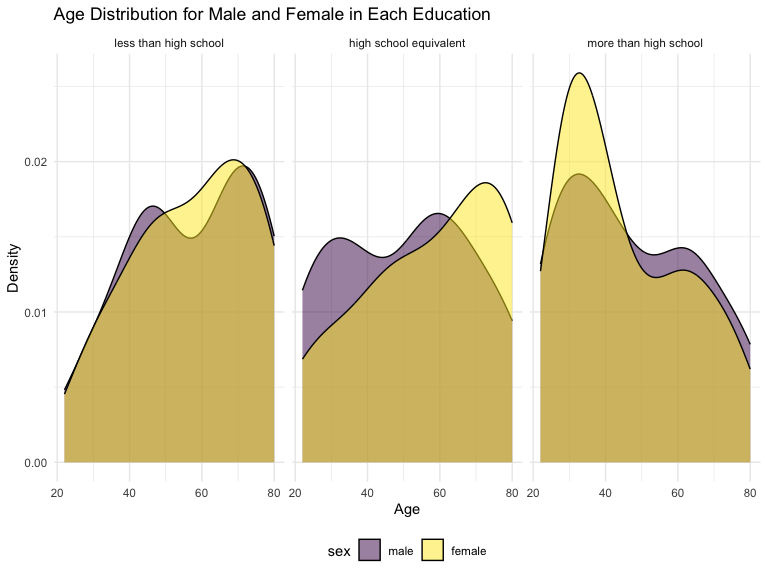

p8105_hw3_hn2453
================
Huiyan Ni
2024-10-16

## Problem 1, study from problem 1 solution.

``` r
library(p8105.datasets)
data("ny_noaa")
head(ny_noaa)
```

    ## # A tibble: 6 × 7
    ##   id          date        prcp  snow  snwd tmax  tmin 
    ##   <chr>       <date>     <int> <int> <int> <chr> <chr>
    ## 1 US1NYAB0001 2007-11-01    NA    NA    NA <NA>  <NA> 
    ## 2 US1NYAB0001 2007-11-02    NA    NA    NA <NA>  <NA> 
    ## 3 US1NYAB0001 2007-11-03    NA    NA    NA <NA>  <NA> 
    ## 4 US1NYAB0001 2007-11-04    NA    NA    NA <NA>  <NA> 
    ## 5 US1NYAB0001 2007-11-05    NA    NA    NA <NA>  <NA> 
    ## 6 US1NYAB0001 2007-11-06    NA    NA    NA <NA>  <NA>

This dataset has 2595176 rows and 7 columns. Variables include
id(Weather station ID), date(Date of observation), prcp(Precipitation
(tenths of mm)), snow(Snowfall (mm)), snwd(Snow depth (mm)),
tmax(Maximum temperature (tenths of degrees C)) and tmin(Minimum
temperature (tenths of degrees C)).

``` r
ny_noaa %>% 
  count(snow) %>%
  arrange(desc(n))
```

    ## # A tibble: 282 × 2
    ##     snow       n
    ##    <int>   <int>
    ##  1     0 2008508
    ##  2    NA  381221
    ##  3    25   31022
    ##  4    13   23095
    ##  5    51   18274
    ##  6    76   10173
    ##  7     8    9962
    ##  8     5    9748
    ##  9    38    9197
    ## 10     3    8790
    ## # ℹ 272 more rows

From previous function, we can get the most counts of snow is 0, then
NA, 25,13 and so on.

Create separate variables for year, month, and day.

``` r
ny_noaa = 
  ny_noaa %>% 
  separate(date, into = c("year", "month", "day"), convert = TRUE) %>% 
  mutate(
    tmax = as.numeric(tmax),
    tmin = as.numeric(tmin))
```

Make a two-panel plot showing the average max temperature in January and
in July in each station across years

``` r
ny_noaa %>% 
  group_by(id, year, month) %>% 
  filter(month %in% c(1, 7)) %>% 
  summarize(mean_tmax = mean(tmax, na.rm = TRUE, color = id)) %>% 
  ggplot(aes(x = year, y = mean_tmax, group = id)) + geom_point() + geom_path() +
  facet_grid(~month) +
  labs(title = "Mean monthly temperature for each station across years for January and July")
```

    ## `summarise()` has grouped output by 'id', 'year'. You can override using the
    ## `.groups` argument.


From the plot, we can see that the mean temperature in January is much
lower than the mean temperature in July for all stations and years. And
the trend for mostly stations in each year is similar. About 1982 years
and 1987 years, there are two outliers.

Make a two-panel plot showing (i) tmax vs tmin for the full dataset
(note that a scatterplot may not be the best option); and (ii) make a
plot showing the distribution of snowfall values greater than 0 and less
than 100 separately by year.

``` r
  ny_noaa %>% 
  ggplot(aes(x = tmin, y = tmax)) + 
  geom_hex()
```



``` r
  ny_noaa %>% 
  filter(snow < 100, snow > 0) %>%
  ggplot(aes(x = snow, y = as.factor(year))) + 
  geom_density_ridges()
```

    ## Picking joint bandwidth of 3.76


From the hex plot, we can see the temperature concentrated on the
center. From the ridge plot, we can see that almost station’s snowfall
between 0 and 35mm. But one station is on 50mm snowfall and one station
is on 80mm snowfall.

## Problem 2

Load, tidy, merge, and otherwise organize the data sets.

``` r
accel = 
  read_csv("data/nhanes_accel.csv",
             col_names = TRUE,
             na = c("","NA"))|>
  janitor::clean_names()
```

    ## Rows: 250 Columns: 1441
    ## ── Column specification ────────────────────────────────────────────────────────
    ## Delimiter: ","
    ## dbl (1441): SEQN, min1, min2, min3, min4, min5, min6, min7, min8, min9, min1...
    ## 
    ## ℹ Use `spec()` to retrieve the full column specification for this data.
    ## ℹ Specify the column types or set `show_col_types = FALSE` to quiet this message.

``` r
head(accel)
```

    ## # A tibble: 6 × 1,441
    ##    seqn  min1  min2  min3  min4   min5   min6  min7   min8    min9  min10  min11
    ##   <dbl> <dbl> <dbl> <dbl> <dbl>  <dbl>  <dbl> <dbl>  <dbl>   <dbl>  <dbl>  <dbl>
    ## 1 62161 1.11  3.12  1.47  0.938 1.60   0.145  2.10  0.509   1.63   1.20   0.947 
    ## 2 62164 1.92  1.67  2.38  0.935 2.59   5.22   2.39  4.90    1.97   3.13   2.77  
    ## 3 62169 5.85  5.18  4.76  6.48  6.85   7.24   6.12  7.48    5.47   6.49   5.14  
    ## 4 62174 5.42  3.48  3.72  3.81  6.85   4.45   0.561 1.61    0.698  2.72   4.85  
    ## 5 62177 6.14  8.06  9.99  6.60  4.57   2.78   7.10  7.25   10.1    7.49   2.72  
    ## 6 62178 0.167 0.429 0.131 1.20  0.0796 0.0487 0.106 0.0653  0.0564 0.0639 0.0909
    ## # ℹ 1,429 more variables: min12 <dbl>, min13 <dbl>, min14 <dbl>, min15 <dbl>,
    ## #   min16 <dbl>, min17 <dbl>, min18 <dbl>, min19 <dbl>, min20 <dbl>,
    ## #   min21 <dbl>, min22 <dbl>, min23 <dbl>, min24 <dbl>, min25 <dbl>,
    ## #   min26 <dbl>, min27 <dbl>, min28 <dbl>, min29 <dbl>, min30 <dbl>,
    ## #   min31 <dbl>, min32 <dbl>, min33 <dbl>, min34 <dbl>, min35 <dbl>,
    ## #   min36 <dbl>, min37 <dbl>, min38 <dbl>, min39 <dbl>, min40 <dbl>,
    ## #   min41 <dbl>, min42 <dbl>, min43 <dbl>, min44 <dbl>, min45 <dbl>, …

The accel dataset includes 150 rows and 1441 columns(one column for seqn
and 1440 columns for each minutes data of a 24-hour day).

``` r
covar = 
  read_csv("data/nhanes_covar.csv",
             col_names = TRUE,
             skip = 4,
             na = c("","NA"))|>
  janitor::clean_names()|>
  filter(!is.na(bmi))|>
  filter(!is.na(education))|>
  filter(age > 21)|>
  mutate(sex = as.factor(sex))|>
  mutate(education = as.factor(education))
```

    ## Rows: 250 Columns: 5
    ## ── Column specification ────────────────────────────────────────────────────────
    ## Delimiter: ","
    ## dbl (5): SEQN, sex, age, BMI, education
    ## 
    ## ℹ Use `spec()` to retrieve the full column specification for this data.
    ## ℹ Specify the column types or set `show_col_types = FALSE` to quiet this message.

``` r
covar$sex <- factor(covar$sex, levels = c(1,2), labels = c("male","female"))

covar$education <- factor(covar$education, levels = c(1,2,3), labels = c("less than high school","high school equivalent","more than high school"))

head(covar)
```

    ## # A tibble: 6 × 5
    ##    seqn sex      age   bmi education             
    ##   <dbl> <fct>  <dbl> <dbl> <fct>                 
    ## 1 62161 male      22  23.3 high school equivalent
    ## 2 62164 female    44  23.2 more than high school 
    ## 3 62174 male      80  33.9 more than high school 
    ## 4 62177 male      51  20.1 high school equivalent
    ## 5 62178 male      80  28.5 high school equivalent
    ## 6 62180 male      35  27.9 more than high school

The covar dataset includes 225 rows and 5 columns. Variables includes
seqn, sex, age, bmi and education. The data with NA already removed, and
the sex and education variable also change from numeric to factor.

``` r
accel_covar = left_join(covar,accel,by="seqn")

head(accel_covar)
```

    ## # A tibble: 6 × 1,445
    ##    seqn sex      age   bmi education  min1  min2  min3  min4   min5   min6  min7
    ##   <dbl> <fct>  <dbl> <dbl> <fct>     <dbl> <dbl> <dbl> <dbl>  <dbl>  <dbl> <dbl>
    ## 1 62161 male      22  23.3 high sch… 1.11  3.12  1.47  0.938 1.60   0.145  2.10 
    ## 2 62164 female    44  23.2 more tha… 1.92  1.67  2.38  0.935 2.59   5.22   2.39 
    ## 3 62174 male      80  33.9 more tha… 5.42  3.48  3.72  3.81  6.85   4.45   0.561
    ## 4 62177 male      51  20.1 high sch… 6.14  8.06  9.99  6.60  4.57   2.78   7.10 
    ## 5 62178 male      80  28.5 high sch… 0.167 0.429 0.131 1.20  0.0796 0.0487 0.106
    ## 6 62180 male      35  27.9 more tha… 0.039 0     0     0     0.369  0.265  0.506
    ## # ℹ 1,433 more variables: min8 <dbl>, min9 <dbl>, min10 <dbl>, min11 <dbl>,
    ## #   min12 <dbl>, min13 <dbl>, min14 <dbl>, min15 <dbl>, min16 <dbl>,
    ## #   min17 <dbl>, min18 <dbl>, min19 <dbl>, min20 <dbl>, min21 <dbl>,
    ## #   min22 <dbl>, min23 <dbl>, min24 <dbl>, min25 <dbl>, min26 <dbl>,
    ## #   min27 <dbl>, min28 <dbl>, min29 <dbl>, min30 <dbl>, min31 <dbl>,
    ## #   min32 <dbl>, min33 <dbl>, min34 <dbl>, min35 <dbl>, min36 <dbl>,
    ## #   min37 <dbl>, min38 <dbl>, min39 <dbl>, min40 <dbl>, min41 <dbl>, …

``` r
sex_table <- covar %>%
  group_by(sex,education) %>%
  summarise(count=n()) 
```

    ## `summarise()` has grouped output by 'sex'. You can override using the `.groups`
    ## argument.

``` r
sex_table
```

    ## # A tibble: 6 × 3
    ## # Groups:   sex [2]
    ##   sex    education              count
    ##   <fct>  <fct>                  <int>
    ## 1 male   less than high school     27
    ## 2 male   high school equivalent    34
    ## 3 male   more than high school     54
    ## 4 female less than high school     28
    ## 5 female high school equivalent    23
    ## 6 female more than high school     59

``` r
ggplot(covar, aes(x = age, fill=sex)) + 
  geom_density(alpha = 0.5) +
  facet_wrap(~education)+
  labs(title="Age Distribution for Male and Female in Each Education",
       x="Age",
       y="Density")
```


From the plot, we can get the age of female is relatively larger than
male in less than high school and high school equivalent, the age of
male is relatively little larger than female in more than high school.
